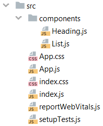

## Components

Met componenten kunnen we een groot bestand of een complexe webstructuur in kleinere componenten opsplitsen. Bijkomend voordeel is dat we de componenten kunnen hergebruiken wanneer ze dezelfde functionaliteit hebben. 

We gaan de volgende website `index.js` in kleinere componenten splitsen.

    import React from "react";
    import ReactDOM from "react-dom";
    
    ReactDOM.render(
      

        <h1>My Favourite Foods</h1>
        <ul>
          <li>Bacon</li>
          <li>Jamon</li>
          <li>Noodles</li>
        </ul>
      
,
      document.getElementById("root")
    );

Als eerste gaan we een `Heading` component maken, dit doe je door middel van een functie. De naam van de functie is in React altijd met een hoofdletter. De `Heading` functie geeft een HTML element terug met behulp van Javascript.

    function Heading() {
      return <h1>My Favourite Foods</h1>;
    }

Nu kun je deze aangepaste `Heading` component in de React-code gebruiken alsof het een HTML-element is: `<Heading />`

    ReactDOM.render(
      

        <Heading />
        <ul>
          <li>Bacon</li>
          <li>Jamon</li>
          <li>Noodles</li>
        </ul>
      
,
      document.getElementById("root")
    );

`Heading` staat nog binnen hetzelfde bestand `index.js` en dat maakt het niet overzichtelijk. We gaan een ES6 functie gebruiken waarbij we onze `Heading` component importeren vanuit een apart bestand.

We maken een nieuw bestand aan in de `src folder` genaamd `Heading.js`. Dit wordt een custom <b>component</b>. We kopiëren de functie in dit bestand. 

Bestanden `index.js` en `Heading.js` moeten met elkaar gelinkt worden. Voor `index.js` is dit import en voor `Heading.js` export.
 
<i>Heading.js</i>
    
    import React from "react";
    
    function Heading() {
      return <h1>My Favourite Foods</h1>;
    }
    
    export default Heading;

<i>index.js</i>

    import React from "react";
    import ReactDOM from "react-dom";
    import Heading from "./Heading";
    
    ReactDOM.render(
      

        <Heading />
        <ul>
          <li>Bacon</li>
          <li>Jamon</li>
          <li>Noodles</li>
        </ul>
      
,
      document.getElementById("root")
    );

We maken ook een custom <b>component</b> voor de lijst.

<i>List.js</i>

    import React from "react";
    
    function List() {
      return (
        <ul>
          <li>Bacon</li>
          <li>Jamon</li>
          <li>Noodles</li>
        </ul>
      );
    }
    
    export default List;

<i>index.js</i>

    import React from "react";
    import ReactDOM from "react-dom";
    import Heading from "./Heading";
    import List from "./List";
    
    ReactDOM.render(
      

        <Heading />
        <List />
      
,
      document.getElementById("root")
    );

Wat je normaal ziet in het bestand `index.js` van veel React apps is dat ze geen HTML elementen zoals een div of een h1 hebben. In plaats daarvan zie je een aangepaste component met de naam `<App/>`. 

Wat je nu in de `index.js` ziet staan, wil je in het bestand genaamd `App.js` hebben. 

<i>index.js</i>

    import React from 'react';
    import ReactDOM from 'react-dom';
    import './index.css';
    import App from './App';
    import reportWebVitals from './reportWebVitals';
    
    ReactDOM.render(
        <React.StrictMode>
            <App />
        </React.StrictMode>,
        document.getElementById('root')
    );
    
    reportWebVitals();

<i>App.js</i>

    import React from "react";
    import './App.css';
    import Heading from "././components/Heading"
    import List from "././components/List"
    
    function App() {
      return (
        

          <Heading />
          <List />
          <List />
        

      );
    }
    
    export default App;

<i>Directory map “components”: Heading.js</i>

    import React from "react";
    
    function Heading() {
      return <h1>My Favourite Foods</h1>;
    }
    
    export default Heading;

<i>Directory map “components”: List.js</i>

    import React from "react";
    
    function List() {
      return (
        <ul>
          <li>Bacon</li>
          <li>Jamon</li>
          <li>Noodles</li>
        </ul>
      );
    }
    
    export default List;

### Mappenstructuur in React

