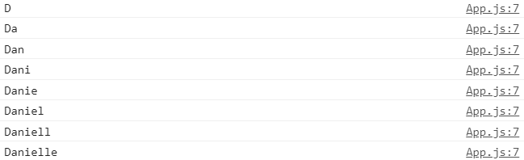
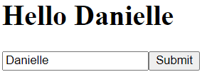

## Controlled components

In HTML houden formulierelementen zoals `<input>`, `<textarea>` en `<select>` meestal hun eigen state bij en werken deze bij op basis van gebruikersinvoer. In React wordt de veranderlijke state bewaard in de state eigenschap van componenten en alleen bijgewerkt met `setState()`.

We kunnen de twee combineren door de React state de "single source of truth" te maken. Dan regelt het React-component dat een formulier rendert ook wat er in dat formulier gebeurt bij daaropvolgende gebruikersinvoer. Een invoer-formulier-element waarvan de waarde op deze manier door React wordt gecontroleerd, wordt een "controlled component" genoemd.

Dus een controlled component is een react-component die de waarden van invoerelementen in een formulier controleert met behulp van `setState()`, in dit voorbeeld `setName()`.

    import React, {useState} from "react";
    
    function App() {
    const [name, setName] = useState("");
    
        function handleChange(event) {
            console.log(event.target.value);
            setName(event.target.value);
        }
    
        return (
            

                <h1>Hello {name}</h1>
                <input
                    onChange={handleChange}
                    type="text"
                    placeholder="What's your name?"
                    value={name}
                />
                <button>Submit</button>
            

        );
    }
    
    export default App;

Wanneer je in bovenstaand voorbeeld een letter in de input invult, komt het gelijk in de console te staan (en boven de input). Zie onderstaande printscreens.

