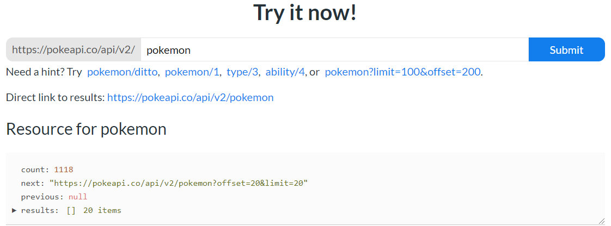
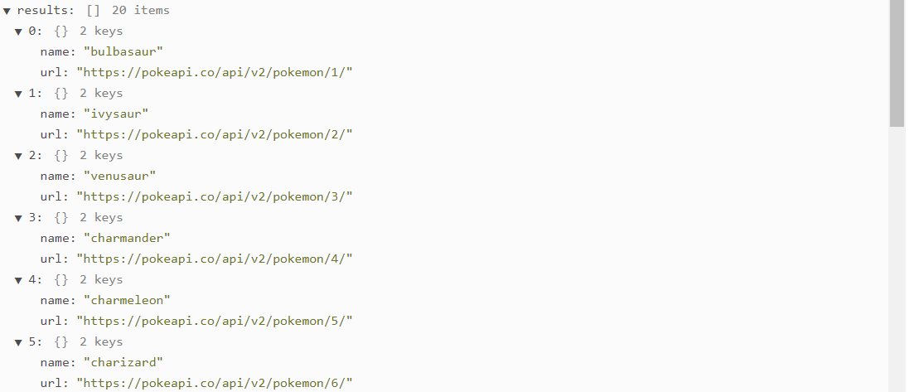
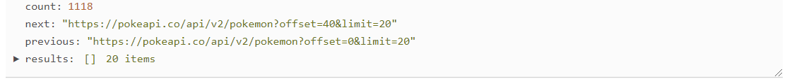

## API voorbeeld Pokémon
Ga naar de pokemon API: https://pokeapi.co/.

Wanneer je in "Try it now!" `pokemon` zet, dus https://pokeapi.co/api/v2/pokemon, zie je dat daar een array [] in zit met 20 items (objecten {}) die alleen de naam en de url van een specifieke pokemon bevatten.

Wat we ook zien is een property "previous", die is nu null want je hebt de eerste 20 pokemon opgevraagd.

We hebben ook een next link en deze next link bevat dezelfde endpoint maar met een beetje extra informatie: https://pokeapi.co/api/v2/pokemon?offset=20&limit=20. Wanneer we nu in "Try it now!" `pokemon?offset=20&limit=20` zetten dan wordt de next knop: https://pokeapi.co/api/v2/pokemon?offset=40&limit=20. Hij gaat dus naar de volgende 20 pokemon.

Je ziet dat je nu ook een previous link heb: https://pokeapi.co/api/v2/pokemon?offset=0&limit=20.

### Stap 1 - axios installeren
We gaan data ophalen dus moeten we axios installeren en importeren: `npm install axios`.

    import React from 'react';
    import axios from 'axios';
    import './App.css';
    
    function App() {
        return (
            

                Hoi!
            

        );
    }
    
    export default App;

### Stap 2 - useEffect functie schrijven

    import React, {useEffect} from 'react';
    import axios from 'axios';
    import './App.css';
    
    function App() {
        useEffect(() => {
            console.log('Ik ben er!')
        }, []);
    
        return (
            

                Hoi!
            

        );
    }

### Stap 3 - async functie schrijven

    function App() {
        useEffect(() => {
            async function fetchPokemon() {
                console.log('Ik word aangeroepen!')
            }
    
            fetchPokemon();
        }, []);
    
        return (
            

                Hoi!
            

        );
    }

### Stap 4 - await schrijven 
We maken een get request en geen post request want we halen data op.

    function App() {
        useEffect(() => {
            async function fetchPokemon() {
                await axios.get('https://pokeapi.co/api/v2/pokemon')
            }
    
            fetchPokemon();
        }, []);
    
        return (
            

                Hoi!
            

        );
    }

### Stap 5 - variabele result maken + loggen
Hetgeen wat we awaiten krijgen we terug uit de get functie, maar dat vangen we nergens op. Het komt wel terug, maar het hangt ergens in de lucht te hangen. Om dit op te vangen gebruiken we een variabele `const`.

    function App() {
        useEffect(() => {
            async function fetchPokemon() {
                const result = await axios.get('https://pokeapi.co/api/v2/pokemon')
                console.log(result);
            }
    
            fetchPokemon();
        }, []);
    
        return (
            

                Hoi!
            

        );
    }

### Stap 6 - log bekijken
Bij het loggen zie je in de console dat er een object uitkomt. 

    {data: {…}, status: 200, statusText: "", headers: {…}, config: {…},…}

In dit object zitten de volgende properties: config, data, headers, request, status, statusText.

    config: {url: "https://pokeapi.co/api/v2/pokemon", method: "get", headers: {…}, transformRequest: Array(1), transformResponse: Array(1), …}
    data: {count: 1118, next: "https://pokeapi.co/api/v2/pokemon?offset=20&limit=20", previous: null, results: Array(20)}
    headers: {cache-control: "public, max-age=86400, s-maxage=86400", content-type: "application/json; charset=utf-8"}
    request: XMLHttpRequest {readyState: 4, timeout: 0, withCredentials: false, upload: XMLHttpRequestUpload, onreadystatechange: ƒ, …}
    status: 200
    statusText: ""

In data zit alle informatie die je wilt hebben.

    count: 1118
    next: "https://pokeapi.co/api/v2/pokemon?offset=20&limit=20"
    previous: null
    results: (20) [{…}, {…}, {…}, {…}, {…}, {…}, {…}, {…}, {…}, {…}, {…}, {…}, {…}, {…}, {…}, {…}

### Stap 7 - data loggen
Je krijgt `count`, `next`, `previous` en `results` te zien in `data`.

De `next` link hebben we nodig om de volgende request te maken en `previous` om terug te gaan.

In `results` staan alle pokemon die we kunnen laten zien.

    function App() {
        useEffect(() => {
            async function fetchPokemon() {
                const result = await axios.get('https://pokeapi.co/api/v2/pokemon')
                console.log(result.data);
            }
    
            fetchPokemon();
        }, []);
    
        return (
            

                Hoi!
            

        );
    }

### Stap 8 - try/catch

    function App() {
        useEffect(() => {
            async function fetchPokemon() {
                try {
                    const result = await axios.get('https://pokeapi.co/api/v2/pokemon')
                    console.log(result.data);
                } catch (e) {
                    console.error(e);
                }
            }
    
            fetchPokemon();
        }, []);
    
        return (
            

                Hoi!
            

        );
    }

### Stap 9 - state aanmaken
Pokemon opslaan in state `pokemons`, `setPokemons`.

De volgende url opslaan in state `nextUrl`, `setNextUrl`.

De vorige url opslaan in state `previousUrl`, `setPreciousUrl`.

Gebruik de `setters` om results, next en previous te loggen.

    import React, {useEffect, useState} from 'react';
    import axios from 'axios';
    import './App.css';
    
    function App() {
        const [pokemons, setPokemons] = useState([]);
        const [nextUrl, setNextUrl] = useState('');
        const [previousUrl, setPreciousUrl] = useState('');
    
        useEffect(() => {
            async function fetchPokemon() {
                try {
                    const result = await axios.get('https://pokeapi.co/api/v2/pokemon')
                    setPokemons(result.data.results);
                    setNextUrl(result.data.next);
                    setPreciousUrl(result.data.previous);
                } catch (e) {
                    console.error(e);
                }
            }
    
            fetchPokemon();
        }, []);
    
        return (
            

                Hoi!
            

        );
    }

### Stap 10 - destructure result

    useEffect(() => {
        async function fetchPokemon() {
            try {
                const {data} = await axios.get('https://pokeapi.co/api/v2/pokemon')
                setPokemons(data.results);
                setNextUrl(data.next);
                setPreciousUrl(data.previous);
            } catch (e) {
                console.error(e);
            }
        }
    
        fetchPokemon();
    }, []);

### Stap 11 - destructure data

    useEffect(() => {
        async function fetchPokemon() {
            try {
                const {data: {results, next, previous}} = await axios.get('https://pokeapi.co/api/v2/pokemon')
                setPokemons(results);
                setNextUrl(next);
                setPreciousUrl(previous);
            } catch (e) {
                console.error(e);
            }
        }
    
        fetchPokemon();
    }, []);

### Stap 12 - button aanmaken in return

    return (
        

            <button type="button">
                Vorige
            </button>
            <button type="button">
                Volgende
            </button>
        

    );

### Stap 13 - pokemons loggen als we pokemons hebben (&&)

    return (
        

            {pokemons && console.log(pokemons)}
            <button type="button">
                Vorige
            </button>
            <button type="button">
                Volgende
            </button>
        

    );

### Stap 14 - fetchpokemon een aantal keer aanroepen
Op het moment dat we op de vorige of volgende knop drukken, willen we dat opnieuw de pokemon worden opgehaald. Dat betekent dat we opnieuw een get request maken, maar dan met de volgende 20 pokemon.

Het zou handig zijn wanneer we dit kunnen hergebruiken, dus i.p.v. dat de async functie in de `useEffect` staat (behalve de aanroep functie, die blijft staan) zetten we hem er buiten.

    function App() {
        const [pokemons, setPokemons] = useState([]);
        const [nextUrl, setNextUrl] = useState('');
        const [previousUrl, setPreciousUrl] = useState('');
    
        async function fetchPokemon() {
            try {
                const {data: {results, next, previous}} = await axios.get('https://pokeapi.co/api/v2/pokemon')
                setPokemons(results);
                setNextUrl(next);
                setPreciousUrl(previous);
            } catch (e) {
                console.error(e);
            }
        }
    
        useEffect(() => {
            fetchPokemon();
        }, []);
    }

### Stap 15 - onClick functie

Nu wordt er in de `useEffect` functie de fetchPokemon aangeroepen voor de aller eerste keer en op het moment dat we op de knoppen volgende en vorige drukken willen we hem opnieuw gaan aanroepen. Dit doen we met een functie `onClick`.

We doen dit met een anonieme functie (omdat we parameter toevoegen, anders hadden we `onClick={fetchPokemon}` kunnen doen), maar we willen meegeven welke url deze functie moet gaan gebruiken.

    function App() {
        const [pokemons, setPokemons] = useState([]);
        const [nextUrl, setNextUrl] = useState('');
        const [previousUrl, setPreciousUrl] = useState('');
    
        async function fetchPokemon() {
            try {
                const {data: {results, next, previous}} = await axios.get('https://pokeapi.co/api/v2/pokemon')
                setPokemons(results);
                setNextUrl(next);
                setPreciousUrl(previous);
            } catch (e) {
                console.error(e);
            }
        }
    
        useEffect(() => {
            fetchPokemon();
        }, []);
    
        return (
            

                {pokemons && console.log(pokemons)}
                <button type="button" onClick={() => fetchPokemon(previousUrl)}>
                    Vorige
                </button>
                <button type="button" onClick={() => fetchPokemon(nextUrl)}>
                    Volgende
                </button>
            

        );
    }

### Stap 16 - url
We roepen een functie aan met parameters, we geven er een argument aan mee maar de functie zelf ontvangt nog helemaal niks (dus het argument vliegt gelijk het raam uit).

We gaan het argument ontvangen `fetchPokemon(url)`.

In plaats van de hardcoded url, willen we de url die we meekrijgen uit de fetchPokemon functie `await axios.get('url')`.

Bij de eerste useEffect moeten we een argument meegeven, en dit is de basis url `fetchPokemon('https://pokeapi.co/api/v2/pokemon');`.

    function App() {
        const [pokemons, setPokemons] = useState([]);
        const [nextUrl, setNextUrl] = useState('');
        const [previousUrl, setPreciousUrl] = useState('');
    
        async function fetchPokemon(url) {
            try {
                const {data: {results, next, previous}} = await axios.get(url)
                setPokemons(results);
                setNextUrl(next);
                setPreciousUrl(previous);
            } catch (e) {
                console.error(e);
            }
        }
    
        useEffect(() => {
            fetchPokemon('https://pokeapi.co/api/v2/pokemon');
        }, []);
    
        return (
            

                {pokemons && console.log(pokemons)}
                <button type="button" onClick={() => fetchPokemon(previousUrl)}>
                    Vorige
                </button>
                <button type="button" onClick={() => fetchPokemon(nextUrl)}>
                    Volgende
                </button>
            

        );
    }

### Stap 17 - button disabelen
Wanneer je bij de eerste keer ophalen van de data op de knop vorige klikt krijg je een error, want bij de eerste keer zijn er geen pokemon.

Het gebruiksvriendelijkst zou zijn om dit te disabelen. We doen een impliciete check, wanneer je null, een lege string of undefined bent dan ben je disabled `disabled={!previousUrl}` en `disabled={!nextUrl}`.

    function App() {
        const [pokemons, setPokemons] = useState([]);
        const [nextUrl, setNextUrl] = useState('');
        const [previousUrl, setPreciousUrl] = useState('');
    
        async function fetchPokemon(url) {
            try {
                const {data: {results, next, previous}} = await axios.get(url)
                setPokemons(results);
                console.log(results);
                setNextUrl(next);
                setPreciousUrl(previous);
            } catch (e) {
                console.error(e);
            }
        }
    
        useEffect(() => {
            fetchPokemon('https://pokeapi.co/api/v2/pokemon');
        }, []);
    }
    
    return (
        

            <button type="button" disabled={!previousUrl} onClick={() => fetchPokemon(previousUrl)}>
                Vorige
            </button>
            <button type="button" disabled={!nextUrl} onClick={() => fetchPokemon(nextUrl)}>
                Volgende
            </button>
        

    );

## Resultaat
    import React, {useEffect, useState} from 'react';
    import axios from 'axios';
    import './App.css';
    
    function App() {
    const [pokemons, setPokemons] = useState([]);
    const [nextUrl, setNextUrl] = useState('');
    const [previousUrl, setPreciousUrl] = useState('');
    
        async function fetchPokemon(url) {
            try {
                const {data: {results, next, previous}} = await axios.get(url)
                setPokemons(results);
                console.log(results);
                setNextUrl(next);
                setPreciousUrl(previous);
            } catch (e) {
                console.error(e);
            }
        }
    
        useEffect(() => {
            fetchPokemon('https://pokeapi.co/api/v2/pokemon');
        }, []);
    
        return (
            

                <button type="button" disabled={!previousUrl} onClick={() => fetchPokemon(previousUrl)}>
                    Vorige
                </button>
                <button type="button" disabled={!nextUrl} onClick={() => fetchPokemon(nextUrl)}>
                    Volgende
                </button>
            

        );
    }
    
    export default App;